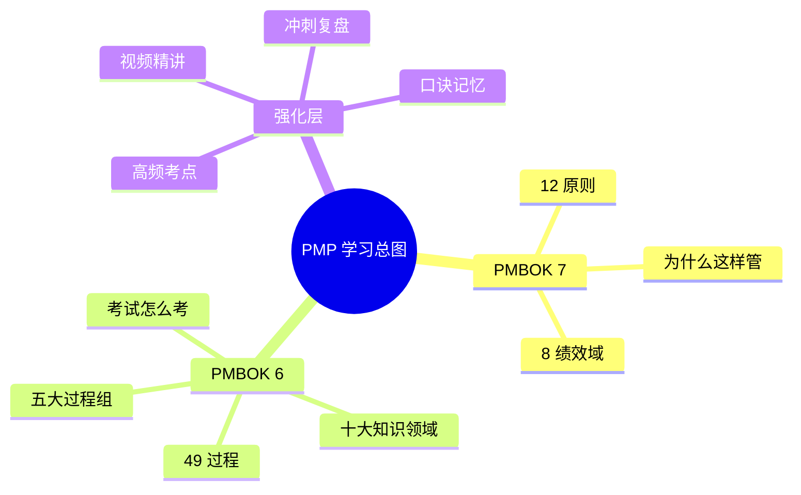
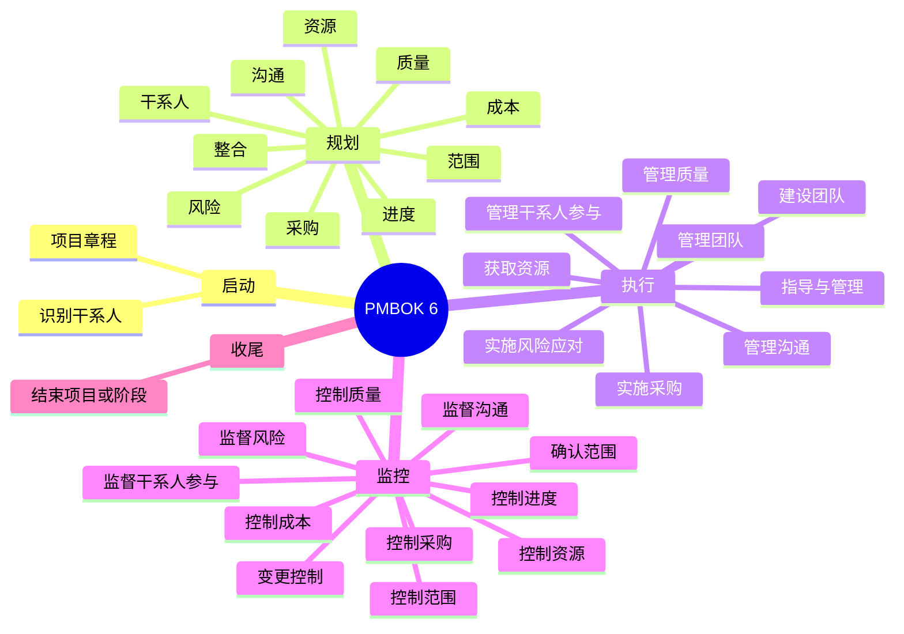
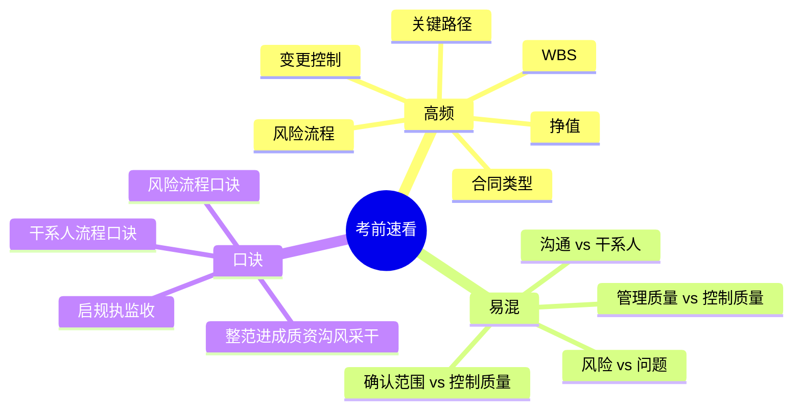

# PMP Learning System Implementation Plan

> **For agentic workers:** REQUIRED SUB-SKILL: Use superpowers:subagent-driven-development (recommended) or superpowers:executing-plans to implement this plan task-by-task. Steps use checkbox (`- [ ]`) syntax for tracking.

**Goal:** Build a local-first PMP 30-day learning system in the current workspace, including a study homepage, a Markdown knowledge base, Bilibili video research and summaries, mnemonic aids, and three mind maps.

**Architecture:** Use a static-file approach. Keep all deliverables under `pmp-learning/`, store video research notes under `research/`, and use a shell verification script to check structure, required sections, and Mermaid mind-map blocks. The learning homepage is a handcrafted `index.html` that summarizes and links the study materials rather than dynamically rendering Markdown.

**Tech Stack:** HTML5, CSS3, vanilla JavaScript, Markdown, Mermaid code blocks, POSIX shell, `rg`

---

**Execution note:** This workspace is currently not a Git repository. Use the checkpoint commands in this plan instead of commits. If the user initializes Git before execution, create a commit at the end of each task using the suggested message in parentheses.

## File Structure

### Files to create

- `scripts/verify-pmp-learning.sh` — structural and content verification script
- `research/bilibili-video-notes.md` — raw candidate list, scoring notes, search date
- `pmp-learning/index.html` — main local study homepage
- `pmp-learning/assets/styles.css` — page layout, color system, typography, responsive rules
- `pmp-learning/assets/app.js` — navigation highlighting, filter toggles, small interactions
- `pmp-learning/00-学习总览.md` — how to use the system and the dual-track method
- `pmp-learning/01-30天计划.md` — day-by-day plan for 30 days
- `pmp-learning/02-PMBOK7-12原则.md` — PMBOK 7 principles notes
- `pmp-learning/03-PMBOK7-8绩效域.md` — PMBOK 7 performance domains notes
- `pmp-learning/04-PMBOK6-五大过程组.md` — process group overview
- `pmp-learning/05-PMBOK6-十大知识领域.md` — knowledge area overview
- `pmp-learning/06-49过程速记.md` — 49-process matrix and quick memory notes
- `pmp-learning/07-B站视频精选与摘要.md` — curated video list and summaries
- `pmp-learning/08-高频考点与易错点.md` — high-frequency points and pitfalls
- `pmp-learning/09-口诀与记忆卡.md` — mnemonic aids and memory cards
- `pmp-learning/10-思维导图.md` — mind-map index and usage notes
- `pmp-learning/mindmaps/pmp-overview.md` — overview mind map
- `pmp-learning/mindmaps/pmbok6-exam-map.md` — PMBOK 6 exam-frame mind map
- `pmp-learning/mindmaps/sprint-review-map.md` — sprint revision mind map

### Files to modify during execution

- `pmp-learning/index.html`
- `pmp-learning/assets/styles.css`
- `pmp-learning/assets/app.js`
- `scripts/verify-pmp-learning.sh`

### Verification target

- `scripts/verify-pmp-learning.sh`

## Task 1: Scaffold The Workspace And Verification Harness

**Files:**
- Create: `scripts/verify-pmp-learning.sh`
- Create: `research/bilibili-video-notes.md`
- Create: `pmp-learning/index.html`
- Create: `pmp-learning/assets/styles.css`
- Create: `pmp-learning/assets/app.js`
- Test: `scripts/verify-pmp-learning.sh`

- [ ] **Step 1: Write the failing structure check**

Create `scripts/verify-pmp-learning.sh` with this content:

```sh
#!/usr/bin/env sh
set -eu

missing=0

require_dir() {
  if [ ! -d "$1" ]; then
    printf 'MISSING DIR: %s\n' "$1"
    missing=1
  fi
}

require_file() {
  if [ ! -f "$1" ]; then
    printf 'MISSING FILE: %s\n' "$1"
    missing=1
  fi
}

require_dir "scripts"
require_dir "research"
require_dir "pmp-learning"
require_dir "pmp-learning/assets"

require_file "scripts/verify-pmp-learning.sh"
require_file "research/bilibili-video-notes.md"
require_file "pmp-learning/index.html"
require_file "pmp-learning/assets/styles.css"
require_file "pmp-learning/assets/app.js"

if [ "$missing" -ne 0 ]; then
  exit 1
fi

printf 'OK: verification passed\n'
```

- [ ] **Step 2: Run the script to verify it fails**

Run: `sh scripts/verify-pmp-learning.sh`

Expected: FAIL with one or more `MISSING DIR:` or `MISSING FILE:` lines, because the scaffold does not exist yet.

- [ ] **Step 3: Create the initial scaffold files**

Create `research/bilibili-video-notes.md`:

```md
# Bilibili PMP 视频调研记录

## 筛选日期

2026-04-08

## 检索关键词

- PMP 零基础 bilibili
- PMP 第七版 bilibili
- PMP 冲刺 bilibili

## 候选视频

| 标题 | 链接 | 类型 | 观察 |
| --- | --- | --- | --- |
```

Create `pmp-learning/index.html`:

```html
<!DOCTYPE html>
<html lang="zh-CN">
<head>
  <meta charset="UTF-8" />
  <meta name="viewport" content="width=device-width, initial-scale=1.0" />
  <title>PMP 30 天学习系统</title>
  <link rel="stylesheet" href="assets/styles.css" />
</head>
<body>
  <main class="page">
    <header class="hero">
      <p class="eyebrow">PMP Learning System</p>
      <h1>PMP 30 天学习系统</h1>
      <p class="hero-copy">从零基础到冲刺复盘的本地学习资料。</p>
    </header>
  </main>
  <script src="assets/app.js"></script>
</body>
</html>
```

Create `pmp-learning/assets/styles.css`:

```css
:root {
  --bg: #f4efe4;
  --panel: #fffdf8;
  --ink: #1f2328;
  --muted: #6b6258;
  --accent: #1f6f5f;
  --accent-soft: #d8ebe5;
  --border: #d9cfbf;
  --shadow: 0 18px 40px rgba(31, 35, 40, 0.08);
}

* {
  box-sizing: border-box;
}

body {
  margin: 0;
  background: radial-gradient(circle at top, #fff8ec 0%, var(--bg) 55%, #ece5d8 100%);
  color: var(--ink);
  font: 16px/1.6 "PingFang SC", "Hiragino Sans GB", "Microsoft YaHei", sans-serif;
}

.page {
  width: min(1120px, calc(100% - 32px));
  margin: 0 auto;
  padding: 40px 0 72px;
}

.hero {
  padding: 32px;
  border: 1px solid var(--border);
  border-radius: 28px;
  background: var(--panel);
  box-shadow: var(--shadow);
}

.eyebrow {
  margin: 0 0 8px;
  color: var(--accent);
  font-weight: 700;
  letter-spacing: 0.08em;
  text-transform: uppercase;
}

.hero h1 {
  margin: 0 0 12px;
  font-size: clamp(2rem, 4vw, 3.6rem);
  line-height: 1.08;
}

.hero-copy {
  margin: 0;
  color: var(--muted);
}
```

Create `pmp-learning/assets/app.js`:

```js
document.documentElement.classList.add("js-ready");
```

- [ ] **Step 4: Run the structure check again**

Run: `sh scripts/verify-pmp-learning.sh`

Expected: PASS with `OK: verification passed`

- [ ] **Step 5: Record the scaffold checkpoint**

Run: `find pmp-learning research scripts -maxdepth 2 -type f | sort`

Expected:

```text
pmp-learning/assets/app.js
pmp-learning/assets/styles.css
pmp-learning/index.html
research/bilibili-video-notes.md
scripts/verify-pmp-learning.sh
```

Suggested git message if Git exists: `chore: scaffold pmp learning workspace`

## Task 2: Build The Homepage Shell

**Files:**
- Modify: `scripts/verify-pmp-learning.sh`
- Modify: `pmp-learning/index.html`
- Modify: `pmp-learning/assets/styles.css`
- Modify: `pmp-learning/assets/app.js`
- Test: `scripts/verify-pmp-learning.sh`

- [ ] **Step 1: Extend the verifier with homepage section checks**

Append these helpers and checks to `scripts/verify-pmp-learning.sh` after `require_file`:

```sh
require_text() {
  file="$1"
  pattern="$2"
  if ! rg -q --fixed-strings "$pattern" "$file"; then
    printf 'MISSING TEXT: %s -> %s\n' "$file" "$pattern"
    missing=1
  fi
}
```

Add these checks before the final success message:

```sh
require_text "pmp-learning/index.html" "section id=\"overview\""
require_text "pmp-learning/index.html" "section id=\"roadmap\""
require_text "pmp-learning/index.html" "section id=\"pmbok7\""
require_text "pmp-learning/index.html" "section id=\"pmbok6\""
require_text "pmp-learning/index.html" "section id=\"videos\""
require_text "pmp-learning/index.html" "section id=\"memory\""
require_text "pmp-learning/index.html" "section id=\"mindmaps\""
require_text "pmp-learning/index.html" "data-filter=\"understand\""
require_text "pmp-learning/index.html" "data-filter=\"exam\""
require_text "pmp-learning/index.html" "data-filter=\"sprint\""
```

- [ ] **Step 2: Run the verifier and confirm the new checks fail**

Run: `sh scripts/verify-pmp-learning.sh`

Expected: FAIL with `MISSING TEXT:` lines for the required section ids and filter buttons.

- [ ] **Step 3: Replace the homepage with the full section layout**

Replace `pmp-learning/index.html` with this structure:

```html
<!DOCTYPE html>
<html lang="zh-CN">
<head>
  <meta charset="UTF-8" />
  <meta name="viewport" content="width=device-width, initial-scale=1.0" />
  <title>PMP 30 天学习系统</title>
  <link rel="stylesheet" href="assets/styles.css" />
</head>
<body>
  <main class="page">
    <header class="hero">
      <p class="eyebrow">PMP Learning System</p>
      <h1>PMP 30 天学习系统</h1>
      <p class="hero-copy">先用 PMBOK 7 建立认知，再用 PMBOK 6 攻克考试框架，最后用视频、口诀和脑图做冲刺复盘。</p>
      <nav class="top-nav">
        <a href="#overview">总览</a>
        <a href="#roadmap">30 天计划</a>
        <a href="#pmbok7">PMBOK 7</a>
        <a href="#pmbok6">PMBOK 6</a>
        <a href="#videos">视频精选</a>
        <a href="#memory">口诀记忆</a>
        <a href="#mindmaps">思维导图</a>
      </nav>
    </header>

    <section id="overview" class="panel">
      <h2>学习总览</h2>
      <p>这套资料分成理解、应试、冲刺三层。理解层用来搞懂项目管理在做什么，应试层用来建立五大过程组和十大知识领域框架，冲刺层用来快速复盘高频考点。</p>
      <div class="badge-row">
        <span class="badge">理解优先</span>
        <span class="badge">应试框架</span>
        <span class="badge">冲刺复盘</span>
      </div>
    </section>

    <section id="roadmap" class="panel">
      <h2>30 天路线</h2>
      <div class="grid three">
        <article class="card">
          <h3>第 1-5 天</h3>
          <p>读懂 PMBOK 7 的 12 原则和 8 绩效域，先建立认知骨架。</p>
        </article>
        <article class="card">
          <h3>第 6-18 天</h3>
          <p>系统攻克 PMBOK 6 的五大过程组、十大知识领域和 49 过程。</p>
        </article>
        <article class="card">
          <h3>第 19-30 天</h3>
          <p>强化高频考点、易错点、口诀和脑图，进入冲刺节奏。</p>
        </article>
      </div>
    </section>

    <section id="pmbok7" class="panel">
      <h2>PMBOK 7 认知主线</h2>
      <p>聚焦 12 原则和 8 绩效域，回答“为什么这样管项目”。</p>
    </section>

    <section id="pmbok6" class="panel">
      <h2>PMBOK 6 应试主线</h2>
      <p>聚焦五大过程组、十大知识领域和 49 过程，回答“考试怎么考、流程怎么串”。</p>
    </section>

    <section id="videos" class="panel">
      <h2>B 站视频精选</h2>
      <div class="toolbar">
        <button type="button" class="filter is-active" data-filter="understand">入门理解</button>
        <button type="button" class="filter" data-filter="exam">系统课</button>
        <button type="button" class="filter" data-filter="sprint">冲刺复盘</button>
      </div>
      <div class="grid three">
        <article class="card" data-track="understand">
          <h3>入门视频</h3>
          <p>帮助零基础快速入门，理解 PMP 到底在学什么。</p>
        </article>
        <article class="card" data-track="exam">
          <h3>系统课程</h3>
          <p>用于跟完整框架，建立第六版和第七版对应关系。</p>
        </article>
        <article class="card" data-track="sprint">
          <h3>冲刺串讲</h3>
          <p>用于最后 7-10 天做高频复盘和查漏补缺。</p>
        </article>
      </div>
    </section>

    <section id="memory" class="panel">
      <h2>口诀与记忆卡</h2>
      <p>只给复杂、易混、需要强记的内容做顺口溜和速记卡，不为了押韵牺牲准确性。</p>
    </section>

    <section id="mindmaps" class="panel">
      <h2>思维导图</h2>
      <ul class="link-list">
        <li><a href="mindmaps/pmp-overview.md">PMP 全局总图</a></li>
        <li><a href="mindmaps/pmbok6-exam-map.md">第六版考试框架图</a></li>
        <li><a href="mindmaps/sprint-review-map.md">冲刺记忆图</a></li>
      </ul>
    </section>
  </main>
  <script src="assets/app.js"></script>
</body>
</html>
```

- [ ] **Step 4: Add responsive styling and filter behavior**

Replace `pmp-learning/assets/styles.css` with:

```css
:root {
  --bg: #f4efe4;
  --panel: #fffdf8;
  --ink: #1f2328;
  --muted: #6b6258;
  --accent: #1f6f5f;
  --accent-soft: #d8ebe5;
  --border: #d9cfbf;
  --shadow: 0 18px 40px rgba(31, 35, 40, 0.08);
}

* { box-sizing: border-box; }

html { scroll-behavior: smooth; }

body {
  margin: 0;
  background: radial-gradient(circle at top, #fff8ec 0%, var(--bg) 55%, #ece5d8 100%);
  color: var(--ink);
  font: 16px/1.7 "PingFang SC", "Hiragino Sans GB", "Microsoft YaHei", sans-serif;
}

a { color: inherit; }

.page {
  width: min(1120px, calc(100% - 32px));
  margin: 0 auto;
  padding: 40px 0 72px;
}

.hero,
.panel {
  border: 1px solid var(--border);
  border-radius: 28px;
  background: var(--panel);
  box-shadow: var(--shadow);
}

.hero {
  padding: 32px;
}

.panel {
  margin-top: 24px;
  padding: 28px;
}

.eyebrow {
  margin: 0 0 8px;
  color: var(--accent);
  font-weight: 700;
  letter-spacing: 0.08em;
  text-transform: uppercase;
}

.hero h1 {
  margin: 0 0 12px;
  font-size: clamp(2rem, 4vw, 3.6rem);
  line-height: 1.08;
}

.hero-copy {
  margin: 0 0 18px;
  color: var(--muted);
  max-width: 64ch;
}

.top-nav {
  display: flex;
  flex-wrap: wrap;
  gap: 10px;
}

.top-nav a,
.badge,
.filter {
  border: 1px solid var(--border);
  border-radius: 999px;
  background: #fff7ea;
  padding: 8px 14px;
}

.badge-row,
.toolbar {
  display: flex;
  flex-wrap: wrap;
  gap: 10px;
  margin-top: 16px;
}

.filter {
  cursor: pointer;
  color: var(--ink);
}

.filter.is-active {
  background: var(--accent);
  border-color: var(--accent);
  color: #fff;
}

.grid {
  display: grid;
  gap: 16px;
}

.grid.three {
  grid-template-columns: repeat(3, minmax(0, 1fr));
}

.card {
  border: 1px solid var(--border);
  border-radius: 20px;
  padding: 18px;
  background: #fffcf5;
}

.card.is-hidden {
  display: none;
}

.link-list {
  margin: 0;
  padding-left: 20px;
}

@media (max-width: 760px) {
  .page {
    width: min(100% - 20px, 1120px);
    padding-top: 20px;
  }

  .hero,
  .panel {
    border-radius: 22px;
    padding: 22px;
  }

  .grid.three {
    grid-template-columns: 1fr;
  }
}
```

Replace `pmp-learning/assets/app.js` with:

```js
const buttons = [...document.querySelectorAll(".filter")];
const cards = [...document.querySelectorAll("[data-track]")];

buttons.forEach((button) => {
  button.addEventListener("click", () => {
    const target = button.dataset.filter;

    buttons.forEach((item) => item.classList.toggle("is-active", item === button));
    cards.forEach((card) => {
      const visible = card.dataset.track === target;
      card.classList.toggle("is-hidden", !visible);
    });
  });
});
```

- [ ] **Step 5: Verify the homepage shell**

Run: `sh scripts/verify-pmp-learning.sh`

Expected: PASS with `OK: verification passed`

Suggested git message if Git exists: `feat: add static homepage shell`

## Task 3: Author The Study Overview, 30-Day Plan, And PMBOK 7 Notes

**Files:**
- Modify: `scripts/verify-pmp-learning.sh`
- Create: `pmp-learning/00-学习总览.md`
- Create: `pmp-learning/01-30天计划.md`
- Create: `pmp-learning/02-PMBOK7-12原则.md`
- Create: `pmp-learning/03-PMBOK7-8绩效域.md`
- Test: `scripts/verify-pmp-learning.sh`

- [ ] **Step 1: Extend the verifier for the first four Markdown files**

Add these file checks:

```sh
require_file "pmp-learning/00-学习总览.md"
require_file "pmp-learning/01-30天计划.md"
require_file "pmp-learning/02-PMBOK7-12原则.md"
require_file "pmp-learning/03-PMBOK7-8绩效域.md"
```

Add these content checks:

```sh
require_text "pmp-learning/00-学习总览.md" "# 学习总览"
require_text "pmp-learning/00-学习总览.md" "## 双主线怎么配合"
require_text "pmp-learning/01-30天计划.md" "# 30 天学习计划"
require_text "pmp-learning/01-30天计划.md" "| Day | 主题 | 必读 | 视频 | 复习动作 |"
require_text "pmp-learning/02-PMBOK7-12原则.md" "# PMBOK 7 的 12 项原则"
require_text "pmp-learning/02-PMBOK7-12原则.md" "| 原则 | 白话解释 | 高频提醒 |"
require_text "pmp-learning/03-PMBOK7-8绩效域.md" "# PMBOK 7 的 8 个绩效域"
require_text "pmp-learning/03-PMBOK7-8绩效域.md" "| 绩效域 | 关注重点 | 和第六版的连接 |"
```

- [ ] **Step 2: Run the verifier and confirm failure**

Run: `sh scripts/verify-pmp-learning.sh`

Expected: FAIL with missing file/text checks for the four Markdown documents.

- [ ] **Step 3: Write the overview and 30-day plan**

Create `pmp-learning/00-学习总览.md`:

```md
# 学习总览

## 这套资料怎么用

- 先看 `01-30天计划.md`，知道每天学什么
- 再按 `02` 和 `03` 建立 PMBOK 7 认知骨架
- 接着按 `04`、`05`、`06` 进入 PMBOK 6 应试框架
- 最后用 `07`、`08`、`09`、`10` 做强化和冲刺

## 双主线怎么配合

- PMBOK 7 解决“为什么这么管理项目”
- PMBOK 6 解决“考试和流程通常怎么考、怎么串”
- 视频资料负责补充讲解节奏
- 口诀和脑图负责把散点串成网络

## 阅读顺序

1. `01-30天计划.md`
2. `02-PMBOK7-12原则.md`
3. `03-PMBOK7-8绩效域.md`
4. `04-PMBOK6-五大过程组.md`
5. `05-PMBOK6-十大知识领域.md`
6. `06-49过程速记.md`
7. `07-B站视频精选与摘要.md`
8. `08-高频考点与易错点.md`
9. `09-口诀与记忆卡.md`
10. `10-思维导图.md`
```

Create `pmp-learning/01-30天计划.md`:

```md
# 30 天学习计划

## 四阶段节奏

- 第 1-5 天：建立整体认知
- 第 6-18 天：系统攻克考试框架
- 第 19-24 天：重点强化
- 第 25-30 天：冲刺复盘

| Day | 主题 | 必读 | 视频 | 复习动作 |
| --- | --- | --- | --- | --- |
| 1 | 了解 PMP 与整体路径 | 00、01 | 入门类总览视频 | 记下不懂术语 |
| 2 | PMBOK 7 总体框架 | 02、03 | 入门类总览视频 | 复述 12 原则与 8 域框架 |
| 3 | 原则 1-6 | 02 | 原则讲解视频 | 用白话重写 6 条原则 |
| 4 | 原则 7-12 | 02 | 原则讲解视频 | 做 12 原则速记卡 |
| 5 | 8 绩效域总览 | 03 | 绩效域讲解视频 | 画出 8 域简图 |
| 6 | 五大过程组总览 | 04 | 系统课第 1 讲 | 记启动到收尾顺序 |
| 7 | 十大知识领域总览 | 05 | 系统课第 2 讲 | 记 10 大领域中文名 |
| 8 | 整合管理 | 05、06 | 系统课整合管理 | 写出变更主线 |
| 9 | 范围管理 | 05、06 | 系统课范围管理 | 区分需求、范围、WBS |
| 10 | 进度管理 | 05、06 | 系统课进度管理 | 记网络图与关键路径 |
| 11 | 成本管理 | 05、06 | 系统课成本管理 | 记挣值核心公式 |
| 12 | 质量管理 | 05、08 | 系统课质量管理 | 区分管理质量与控制质量 |
| 13 | 资源管理 | 05、08 | 系统课资源管理 | 区分团队与实体资源 |
| 14 | 沟通管理 | 05、08 | 系统课沟通管理 | 记沟通模型与沟通渠道 |
| 15 | 风险管理 | 05、08 | 系统课风险管理 | 记风险流程顺序 |
| 16 | 采购管理 | 05、08 | 系统课采购管理 | 区分合同类型 |
| 17 | 干系人管理 | 05、08 | 系统课干系人管理 | 记识别-规划-管理-监督 |
| 18 | 49 过程矩阵串联 | 06 | 系统课总复盘 | 默写过程组 x 领域矩阵 |
| 19 | 高频考点一轮 | 08 | 冲刺类串讲 | 标出最虚弱的 3 块 |
| 20 | 易混概念一轮 | 08 | 冲刺类串讲 | 做易混对照表 |
| 21 | 口诀一轮 | 09 | 口诀/串讲视频 | 背顺口溜并反推含义 |
| 22 | 视频查漏补缺 | 07 | 按弱项补看 | 每块补一页笔记 |
| 23 | 第七版与第六版对照 | 02、03、04、05 | 对照讲解视频 | 写一张对应表 |
| 24 | 高频错点复盘 | 08、09 | 冲刺类串讲 | 重背易错项 |
| 25 | 看全局脑图 | 10 | 冲刺类总复盘 | 口头串讲全图 |
| 26 | 看第六版考试图 | 10 | 冲刺类总复盘 | 口头串讲 49 过程 |
| 27 | 看冲刺记忆图 | 10 | 冲刺类总复盘 | 速记公式和流程 |
| 28 | 回看弱项专题 | 05、08、09 | 针对弱项 | 修正错记内容 |
| 29 | 最后总复盘 | 00-10 | 冲刺类总复盘 | 从头到尾讲一遍 |
| 30 | 轻量复习 | 08、09、10 | 不补新课 | 只看高频与口诀 |
```

- [ ] **Step 4: Write the PMBOK 7 notes**

Create `pmp-learning/02-PMBOK7-12原则.md`:

```md
# PMBOK 7 的 12 项原则

## 怎么读这份笔记

- 先看白话解释
- 再看高频提醒
- 最后自己举一个项目场景

| 原则 | 白话解释 | 高频提醒 |
| --- | --- | --- |
| 做好价值交付的管家 | 项目不是只交付产物，更要交付价值 | 考题喜欢考“客户价值”而不是“只赶进度” |
| 做有责任感的管理者 | 讲诚信、责任、尊重 | 遇到伦理题先看职业操守 |
| 与干系人真正协同 | 不是通知干系人，而是持续互动 | 干系人问题常跨沟通与参与 |
| 聚焦系统思维 | 项目不是孤立动作，要看整体联动 | 题目常考“局部最优不等于整体最优” |
| 发挥领导力 | 不是只发命令，而是带方向、促协作 | 领导力题常落在冲突和激励 |
| 根据情境裁剪 | 不同项目用不同方法，不是死套流程 | 第七版很强调裁剪而不是一刀切 |
| 把质量内建进去 | 质量不是最后检查出来的 | 质量规划与质量控制要区分 |
| 管理复杂性 | 接受不确定、动态变化和反馈循环 | 复杂项目不能只靠线性计划 |
| 优化风险应对 | 风险不仅是坏事，也包含机会 | 风险题常考先识别再分析再应对 |
| 保持适应性与韧性 | 项目环境会变，要能调整 | 变化环境下先评估再响应 |
| 拥抱变革 | 变更不可避免，关键是有序管理 | 与整合管理、变更控制关系紧密 |
| 让团队和干系人持续学习 | 项目也是学习系统 | 复盘、经验教训、高效反馈都属于这里 |
```

Create `pmp-learning/03-PMBOK7-8绩效域.md`:

```md
# PMBOK 7 的 8 个绩效域

## 记忆方式

- 先看每个绩效域解决的问题
- 再看它和第六版更像哪个知识领域
- 最后想想它通常会出现在什么题目里

| 绩效域 | 关注重点 | 和第六版的连接 |
| --- | --- | --- |
| 干系人 | 识别、分析、参与、协同 | 干系人管理、沟通管理 |
| 团队 | 团队文化、领导、协作、能力 | 资源管理、沟通管理 |
| 开发方法和生命周期 | 预测型、敏捷型、混合型怎么选 | 裁剪、整合管理 |
| 规划 | 路线、范围、节奏、基线、适应性计划 | 整合、范围、进度、成本 |
| 项目工作 | 执行、协调、交付、变更推进 | 执行过程组、整合管理 |
| 交付 | 价值、可交付成果、验收 | 范围、质量、干系人 |
| 测量 | 用数据看健康度和绩效 | 成本、进度、质量、挣值 |
| 不确定性 | 风险、模糊性、复杂性、韧性 | 风险管理、变更管理 |
```

- [ ] **Step 5: Verify the new Markdown files**

Run: `sh scripts/verify-pmp-learning.sh`

Expected: PASS with the same final success message and no missing file/text checks.

Suggested git message if Git exists: `docs: add roadmap and pmbok7 study notes`

## Task 4: Author The PMBOK 6 Study Core And Memory Aids

**Files:**
- Modify: `scripts/verify-pmp-learning.sh`
- Create: `pmp-learning/04-PMBOK6-五大过程组.md`
- Create: `pmp-learning/05-PMBOK6-十大知识领域.md`
- Create: `pmp-learning/06-49过程速记.md`
- Create: `pmp-learning/08-高频考点与易错点.md`
- Create: `pmp-learning/09-口诀与记忆卡.md`
- Test: `scripts/verify-pmp-learning.sh`

- [ ] **Step 1: Extend the verifier for PMBOK 6 core documents**

Add these file checks:

```sh
require_file "pmp-learning/04-PMBOK6-五大过程组.md"
require_file "pmp-learning/05-PMBOK6-十大知识领域.md"
require_file "pmp-learning/06-49过程速记.md"
require_file "pmp-learning/08-高频考点与易错点.md"
require_file "pmp-learning/09-口诀与记忆卡.md"
```

Add these content checks:

```sh
require_text "pmp-learning/04-PMBOK6-五大过程组.md" "# PMBOK 6 的五大过程组"
require_text "pmp-learning/05-PMBOK6-十大知识领域.md" "# PMBOK 6 的十大知识领域"
require_text "pmp-learning/06-49过程速记.md" "# 49 过程速记"
require_text "pmp-learning/06-49过程速记.md" "## 49 过程矩阵"
require_text "pmp-learning/08-高频考点与易错点.md" "# 高频考点与易错点"
require_text "pmp-learning/09-口诀与记忆卡.md" "# 口诀与记忆卡"
```

- [ ] **Step 2: Run the verifier and confirm failure**

Run: `sh scripts/verify-pmp-learning.sh`

Expected: FAIL with missing file/text checks for the PMBOK 6 study files.

- [ ] **Step 3: Write the process group and knowledge area summaries**

Create `pmp-learning/04-PMBOK6-五大过程组.md`:

```md
# PMBOK 6 的五大过程组

## 顺序主线

启动 -> 规划 -> 执行 -> 监控 -> 收尾

## 五大过程组白话版

| 过程组 | 核心问题 | 学习提醒 |
| --- | --- | --- |
| 启动 | 为什么做、谁拍板、目标是什么 | 启动不是做细计划 |
| 规划 | 怎么做、做多少、花多久、花多少钱 | 规划是考试高频区 |
| 执行 | 按计划推进、协调资源、产出成果 | 执行与监控经常交替出现 |
| 监控 | 是否偏了、要不要改、怎么纠偏 | 监控是场景题高频 |
| 收尾 | 如何正式结束、沉淀经验、移交成果 | 收尾别漏经验教训 |

## 容易混的点

- 执行不等于监控
- 启动不等于规划
- 收尾不只是签字，还包括经验教训归档
```

Create `pmp-learning/05-PMBOK6-十大知识领域.md`:

```md
# PMBOK 6 的十大知识领域

## 十大领域速览

| 知识领域 | 主要解决什么问题 | 高频提醒 |
| --- | --- | --- |
| 整合 | 把项目整体串起来 | 变更控制是整合核心 |
| 范围 | 做什么、不做什么 | 需求、范围、WBS 常混 |
| 进度 | 何时完成 | 关键路径、进度压缩常考 |
| 成本 | 花多少钱、花得值不值 | 挣值公式高频 |
| 质量 | 做得好不好 | 管理质量与控制质量要分清 |
| 资源 | 谁来做、资源够不够 | 团队建设和资源分配都在这里 |
| 沟通 | 信息怎么传、传给谁 | 沟通渠道数常考 |
| 风险 | 有什么不确定、怎么应对 | 风险流程顺序必须熟 |
| 采购 | 买什么、怎么签、怎么管合同 | 合同类型高频 |
| 干系人 | 谁受影响、如何参与 | 识别和参与策略常考 |
```

- [ ] **Step 4: Write the 49-process matrix, pitfalls, and mnemonics**

Create `pmp-learning/06-49过程速记.md`:

```md
# 49 过程速记

## 49 过程矩阵

| 知识领域 | 启动 | 规划 | 执行 | 监控 | 收尾 |
| --- | --- | --- | --- | --- | --- |
| 整合 | 制定项目章程 | 制定项目管理计划 | 指导与管理项目工作、管理项目知识 | 监控项目工作、实施整体变更控制 | 结束项目或阶段 |
| 范围 |  | 规划范围管理、收集需求、定义范围、创建 WBS |  | 确认范围、控制范围 |  |
| 进度 |  | 规划进度管理、定义活动、排列活动顺序、估算活动持续时间、制定进度计划 |  | 控制进度 |  |
| 成本 |  | 规划成本管理、估算成本、制定预算 |  | 控制成本 |  |
| 质量 |  | 规划质量管理 | 管理质量 | 控制质量 |  |
| 资源 |  | 规划资源管理、估算活动资源 | 获取资源、建设团队、管理团队 | 控制资源 |  |
| 沟通 |  | 规划沟通管理 | 管理沟通 | 监督沟通 |  |
| 风险 |  | 规划风险管理、识别风险、实施定性风险分析、实施定量风险分析、规划风险应对 | 实施风险应对 | 监督风险 |  |
| 采购 |  | 规划采购管理 | 实施采购 | 控制采购 |  |
| 干系人 | 识别干系人 | 规划干系人参与 | 管理干系人参与 | 监督干系人参与 |  |

## 速记建议

- 先按过程组记大框架
- 再按知识领域记内部顺序
- 最后重点盯整合、范围、进度、成本、风险、干系人
```

Create `pmp-learning/08-高频考点与易错点.md`:

```md
# 高频考点与易错点

## 高频考点

- 整体变更控制主线
- WBS 与范围基准
- 关键路径与进度压缩
- 挣值管理核心公式
- 风险流程顺序
- 合同类型差异
- 沟通渠道数
- 干系人参与策略

## 易错点

| 易错主题 | 常见混淆 | 正确抓手 |
| --- | --- | --- |
| 管理质量 vs 控制质量 | 一个偏过程改进，一个偏结果检查 | 先看题目是在改过程还是查结果 |
| 风险 vs 问题 | 风险未发生，问题已发生 | 题干有没有发生是第一判断点 |
| 变更请求 vs 缺陷补救 | 缺陷补救是让结果回到合格状态 | 不是所有改动都算范围变更 |
| 沟通管理 vs 干系人管理 | 一个偏信息流，一个偏关系与参与 | 看题目是“传信息”还是“管人” |
| 确认范围 vs 控制质量 | 一个看客户验收，一个看质量标准 | 验收主体不同是核心线索 |
```

Create `pmp-learning/09-口诀与记忆卡.md`:

```md
# 口诀与记忆卡

## 五大过程组口诀

- 启规执监收：先立项，再定法，边做边看，最后收

## 十大知识领域口诀

- 整范进成质，资沟风采干

## 风险流程口诀

- 先规后识，再定再量，跟着应对，最后监督

## 干系人流程口诀

- 先识别，再规划，后管理，再监督

## 挣值记忆卡

- PV：计划做到哪
- EV：实际挣到哪
- AC：实际花了多少
- CPI = EV / AC：钱花得值不值
- SPI = EV / PV：进度赶没赶上

## 使用提醒

- 口诀只用于快速提取，不替代理解
- 每背一句，都要能反推原始概念
```

- [ ] **Step 5: Verify the PMBOK 6 core**

Run: `sh scripts/verify-pmp-learning.sh`

Expected: PASS with all structure and content checks satisfied.

Suggested git message if Git exists: `docs: add pmbok6 core notes and mnemonics`

## Task 5: Research Bilibili Videos And Write The Video Digest

**Files:**
- Modify: `scripts/verify-pmp-learning.sh`
- Modify: `research/bilibili-video-notes.md`
- Create: `pmp-learning/07-B站视频精选与摘要.md`
- Test: `scripts/verify-pmp-learning.sh`

- [ ] **Step 1: Extend the verifier for video research outputs**

Add these file and text checks:

```sh
require_file "pmp-learning/07-B站视频精选与摘要.md"
require_text "research/bilibili-video-notes.md" "# Bilibili PMP 视频调研记录"
require_text "research/bilibili-video-notes.md" "## 筛选日期"
require_text "pmp-learning/07-B站视频精选与摘要.md" "# B 站视频精选与摘要"
require_text "pmp-learning/07-B站视频精选与摘要.md" "## 入门类"
require_text "pmp-learning/07-B站视频精选与摘要.md" "## 系统课类"
require_text "pmp-learning/07-B站视频精选与摘要.md" "## 冲刺类"
require_text "pmp-learning/07-B站视频精选与摘要.md" "筛选日期："
```

- [ ] **Step 2: Run the verifier and confirm failure**

Run: `sh scripts/verify-pmp-learning.sh`

Expected: FAIL because the final video digest does not exist yet.

- [ ] **Step 3: Perform Bilibili research using exact query buckets**

During execution, run web searches for these query strings and capture the results in `research/bilibili-video-notes.md`:

```text
PMP 零基础 bilibili
PMP 第七版 bilibili
PMP 项目管理 系统课 bilibili
PMP 冲刺 串讲 bilibili
PMBOK 7 PMP bilibili
```

Use this candidate table format in `research/bilibili-video-notes.md`:

```md
## 筛选日期

2026-04-08

## 检索关键词

- PMP 零基础 bilibili
- PMP 第七版 bilibili
- PMP 项目管理 系统课 bilibili
- PMP 冲刺 串讲 bilibili
- PMBOK 7 PMP bilibili

## 候选视频

| 标题 | 链接 | 类型 | 播放/收藏/点赞 | 评论口碑 | 适合阶段 | 观察 |
| --- | --- | --- | --- | --- | --- | --- |
```

Use this selection rubric while researching:

- 入门类优先零基础友好、讲框架清楚、时长适中
- 系统课类优先成套完整、更新相对近、评论区反馈稳定
- 冲刺类优先高频总结密集、适合最后 7-10 天复盘

- [ ] **Step 4: Write the final curated video digest**

Create `pmp-learning/07-B站视频精选与摘要.md` with this opening:

```md
# B 站视频精选与摘要

筛选日期：2026-04-08

## 使用方法

- 入门类先看 1-2 个，不要一口气看太多
- 系统课按 30 天计划穿插看
- 冲刺类放在第 19 天以后
```

Then add three sections in this exact order:

- `## 入门类`
- `## 系统课类`
- `## 冲刺类`

For each selected video, use the actual Bilibili video title as the `###` heading and write the fields in this exact order:

- `- 链接：完整 https://www.bilibili.com/video/... 链接`
- `- 推荐理由：一句话解释为什么入选`
- `- 适合阶段：第 X-Y 天`
- `- 覆盖主题：列出 2-4 个核心主题`
- `- 内容摘要：用 2-4 句写清它讲了什么`
- `- 建议重点记忆内容：列出需要重点记的概念、流程或公式`
- `- 对应教材：写明关联到 PMBOK 6 / PMBOK 7 的哪部分`

Populate each section with real videos from the research notes. Target at least:

- 入门类：2 个条目
- 系统课类：2-4 个条目
- 冲刺类：2 个条目

- [ ] **Step 5: Verify the video digest structure**

Run: `sh scripts/verify-pmp-learning.sh`

Expected: PASS. Then manually inspect `research/bilibili-video-notes.md` to ensure every selected video in `07-B站视频精选与摘要.md` also appears in the research notes.

Suggested git message if Git exists: `docs: add bilibili video research and summaries`

## Task 6: Create The Mind Maps And Mind-Map Index

**Files:**
- Modify: `scripts/verify-pmp-learning.sh`
- Create: `pmp-learning/mindmaps/pmp-overview.md`
- Create: `pmp-learning/mindmaps/pmbok6-exam-map.md`
- Create: `pmp-learning/mindmaps/sprint-review-map.md`
- Create: `pmp-learning/10-思维导图.md`
- Test: `scripts/verify-pmp-learning.sh`

- [ ] **Step 1: Extend the verifier for Mermaid mind maps**

Add this helper:

```sh
require_mermaid() {
  file="$1"
  require_text "$file" "```mermaid"
  require_text "$file" "mindmap"
}
```

Add these file checks:

```sh
require_file "pmp-learning/10-思维导图.md"
require_file "pmp-learning/mindmaps/pmp-overview.md"
require_file "pmp-learning/mindmaps/pmbok6-exam-map.md"
require_file "pmp-learning/mindmaps/sprint-review-map.md"
```

Add these content checks:

```sh
require_text "pmp-learning/10-思维导图.md" "# 思维导图"
require_mermaid "pmp-learning/mindmaps/pmp-overview.md"
require_mermaid "pmp-learning/mindmaps/pmbok6-exam-map.md"
require_mermaid "pmp-learning/mindmaps/sprint-review-map.md"
```

- [ ] **Step 2: Run the verifier and confirm failure**

Run: `sh scripts/verify-pmp-learning.sh`

Expected: FAIL because the mind-map files do not exist yet.

- [ ] **Step 3: Create the three Mermaid mind maps**

Create `pmp-learning/mindmaps/pmp-overview.md`:

````md
# PMP 全局总图


````

Create `pmp-learning/mindmaps/pmbok6-exam-map.md`:

````md
# 第六版考试框架图


````

Create `pmp-learning/mindmaps/sprint-review-map.md`:

````md
# 冲刺记忆图


````

- [ ] **Step 4: Create the mind-map index**

Create `pmp-learning/10-思维导图.md`:

```md
# 思维导图

## 使用顺序

1. 先看 `mindmaps/pmp-overview.md`，建立全局框架
2. 再看 `mindmaps/pmbok6-exam-map.md`，攻克考试结构
3. 最后看 `mindmaps/sprint-review-map.md`，用于冲刺复盘

## 导图文件

- [PMP 全局总图](mindmaps/pmp-overview.md)
- [第六版考试框架图](mindmaps/pmbok6-exam-map.md)
- [冲刺记忆图](mindmaps/sprint-review-map.md)
```

- [ ] **Step 5: Verify the mind maps**

Run: `sh scripts/verify-pmp-learning.sh`

Expected: PASS with all Mermaid checks satisfied.

Suggested git message if Git exists: `docs: add mermaid mind maps`

## Task 7: Final Integration, Cross-Links, And QA

**Files:**
- Modify: `scripts/verify-pmp-learning.sh`
- Modify: `pmp-learning/index.html`
- Modify: `pmp-learning/assets/styles.css`
- Modify: `pmp-learning/assets/app.js`
- Modify: `pmp-learning/00-学习总览.md`
- Test: `scripts/verify-pmp-learning.sh`

- [ ] **Step 1: Extend the verifier for the final integration links**

Add these checks:

```sh
require_text "pmp-learning/index.html" "00-学习总览.md"
require_text "pmp-learning/index.html" "01-30天计划.md"
require_text "pmp-learning/index.html" "07-B站视频精选与摘要.md"
require_text "pmp-learning/index.html" "10-思维导图.md"
require_text "pmp-learning/00-学习总览.md" "10-思维导图.md"
require_text "research/bilibili-video-notes.md" "## 筛选日期"
```

- [ ] **Step 2: Run the verifier and confirm failure**

Run: `sh scripts/verify-pmp-learning.sh`

Expected: FAIL until the homepage and overview file expose the final material links.

- [ ] **Step 3: Add the final material index and learning badges**

Append this block inside `section id="overview"` in `pmp-learning/index.html`:

```html
    <ul class="link-list">
      <li><a href="00-学习总览.md">学习总览</a></li>
      <li><a href="01-30天计划.md">30 天计划</a></li>
      <li><a href="02-PMBOK7-12原则.md">PMBOK 7 的 12 项原则</a></li>
      <li><a href="03-PMBOK7-8绩效域.md">PMBOK 7 的 8 个绩效域</a></li>
      <li><a href="04-PMBOK6-五大过程组.md">PMBOK 6 的五大过程组</a></li>
      <li><a href="05-PMBOK6-十大知识领域.md">PMBOK 6 的十大知识领域</a></li>
      <li><a href="06-49过程速记.md">49 过程速记</a></li>
      <li><a href="07-B站视频精选与摘要.md">B 站视频精选与摘要</a></li>
      <li><a href="08-高频考点与易错点.md">高频考点与易错点</a></li>
      <li><a href="09-口诀与记忆卡.md">口诀与记忆卡</a></li>
      <li><a href="10-思维导图.md">思维导图</a></li>
    </ul>
```

Append this section to `pmp-learning/00-学习总览.md`:

```md
## 对应资料入口

- `02-PMBOK7-12原则.md`
- `03-PMBOK7-8绩效域.md`
- `04-PMBOK6-五大过程组.md`
- `05-PMBOK6-十大知识领域.md`
- `06-49过程速记.md`
- `07-B站视频精选与摘要.md`
- `08-高频考点与易错点.md`
- `09-口诀与记忆卡.md`
- `10-思维导图.md`
```

If the page needs more polish, add a small badge legend in `index.html`:

```html
      <div class="badge-row">
        <span class="badge">必学</span>
        <span class="badge">选学</span>
        <span class="badge">冲刺看</span>
      </div>
```

- [ ] **Step 4: Run the automated verification**

Run: `sh scripts/verify-pmp-learning.sh`

Expected: PASS with all file, text, and Mermaid checks satisfied.

- [ ] **Step 5: Do the final manual review**

Run: `open pmp-learning/index.html`

Expected: The browser opens the local homepage. Manually confirm:

- Desktop layout is readable
- Mobile-width simulation in browser still shows stacked cards cleanly
- Filter buttons only show one video card at a time
- The link list opens the Markdown files
- Mind-map links point to the three Mermaid source files

Suggested git message if Git exists: `feat: finish integrated pmp learning pack`
