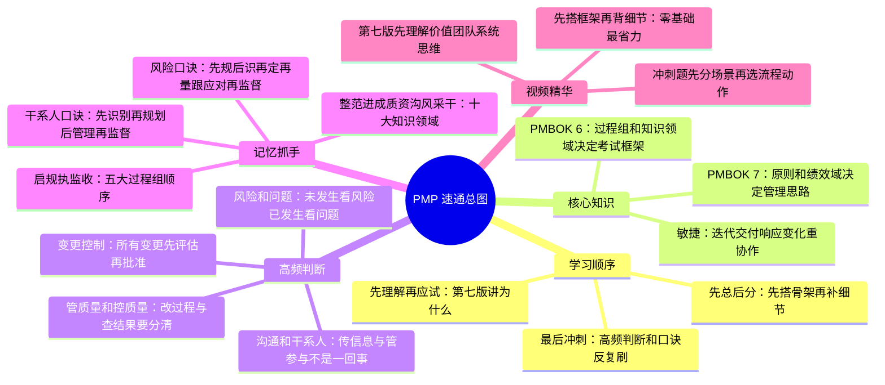
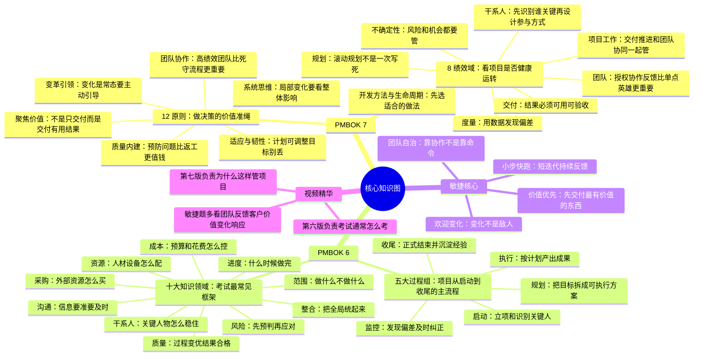
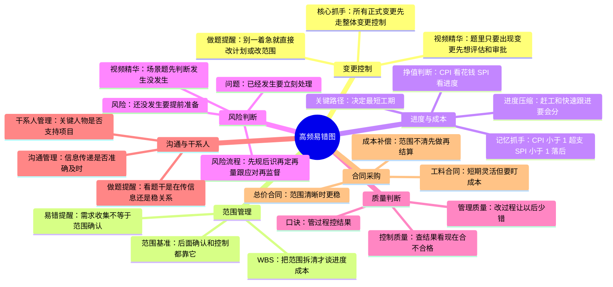
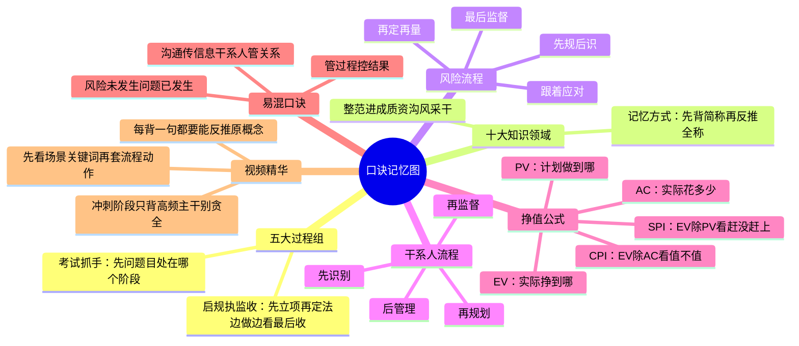

# PMP 纯脑图学习包

这份脑图包是新的核心学习入口。

使用原则：

- 先看总脑图，建立主线
- 再看核心知识图，把 PMBOK 7 和 PMBOK 6 串起来
- 再看高频易错图，训练做题判断
- 最后刷口诀记忆图，用于考前冲刺

## PMP 总脑图
> slug: pmp-master-map
> eyebrow: Master Brainmap
> description: 先搭全局骨架，再进入核心知识、高频判断和记忆冲刺。

## 核心知识图
> slug: core-knowledge-map
> eyebrow: Core Knowledge Map
> description: 把 PMBOK 7 的理解主线、PMBOK 6 的应试主线和敏捷核心串成一张图。

## 高频易错图
> slug: exam-pitfall-map
> eyebrow: Exam Pitfall Map
> description: 这张图专门压缩最常考、最易混、做题最需要快速判断的场景抓手。

## 口诀记忆图
> slug: memory-map
> eyebrow: Memory Map
> description: 把最需要强记的顺序、公式和判断口令压缩到一张图里，适合考前高频刷。

