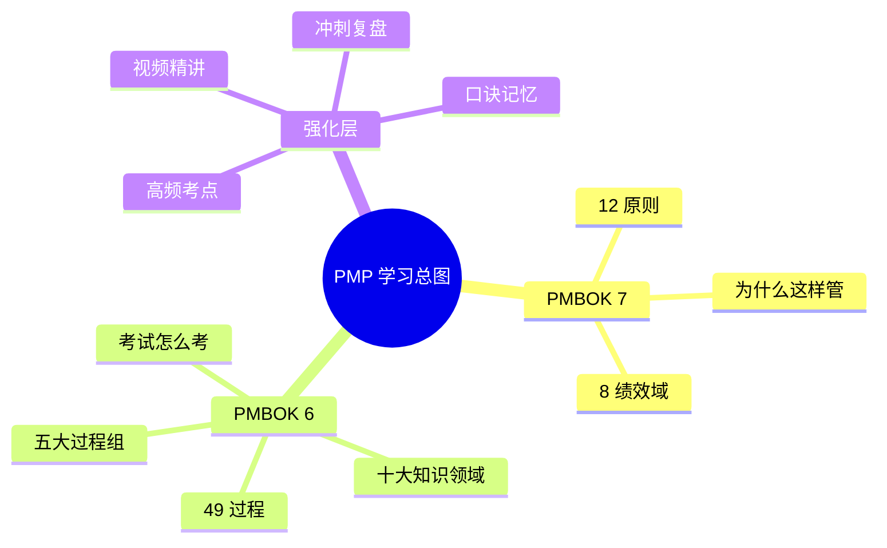

# PMP 全局总图

```mermaid
mindmap
  root((PMP 学习总图))
    PMBOK 7
      12 原则
      8 绩效域
      为什么这样管
    PMBOK 6
      五大过程组
      十大知识领域
      49 过程
      考试怎么考
    强化层
      视频精讲
      高频考点
      口诀记忆
      冲刺复盘
```
